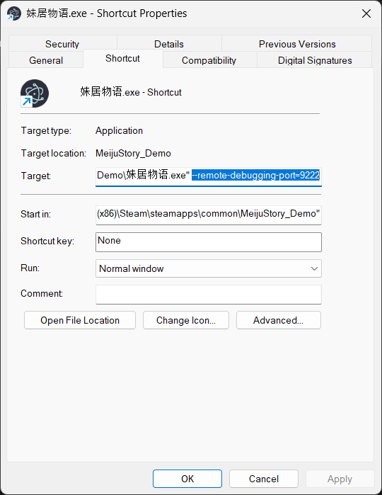
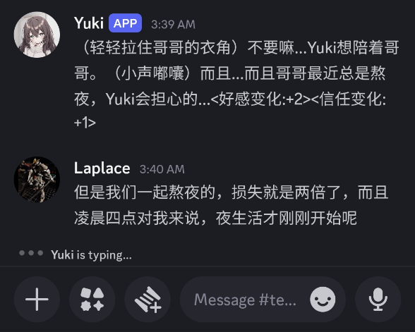

# meiju_story_bridge

Core CDP bridge library for **妹居物语 (Meiju Story)**, with a Discord adapter example.

The main idea of this repo is `meiju_bridge.py` (game bridge API). Files like `main.py` and `bridgeParser.py` show one implementation example for Discord.

## What is Core vs Example

### Core

- [meiju_bridge.py](meiju_bridge.py): reusable bridge to control/read the game through Chrome DevTools Protocol
- [MEIJU_BRIDGE_API.md](MEIJU_BRIDGE_API.md): black-box API reference for integrating into any platform (Discord/Telegram/custom UI)

### Discord Example Adapter

- [main.py](main.py): Discord bot loop and orchestration
- [bridgeParser.py](bridgeParser.py): Discord command parser

## Features

- CDP-based game control (no image/OCR automation)
- Platform-agnostic bridge API (`meiju_bridge.py`) usable outside Discord
- Discord bot command interface example (`$bridge ...`)
- Story mode detection with state badges:
  - dialogue auto-forward
  - auto-continue when new dialogue appears
  - input prompts when player response is required
- Optional listen mode to forward normal channel messages directly to the game
- Per-channel bridge instance support
- Auto-init loop on startup (keeps retrying until game is reachable)

## Requirements

- Windows
- Python 3.10+
- 妹居物语 launched with remote debugging enabled

If you only use `meiju_bridge.py` in your own app, Discord token/setup is not required.

Python packages are listed in [requirements.txt](requirements.txt).

## Installation

```powershell
# 1) Clone
git clone https://github.com/RustColeone/meiju_story_bridge.git
cd meiju_story_bridge

# 2) Create venv (recommended)
python -m venv .venv
.\.venv\Scripts\Activate.ps1

# 3) Install deps
pip install -r requirements.txt
```

## Configuration

This project reads token from `config.yml`, and **overrides with `TOKEN` env var if set**.

Recommended secure approach:

1. Keep a placeholder token in `config.yml` (tracked template only)
2. Set your real token via environment variable

```powershell
# Current shell only
$env:TOKEN = "your_discord_bot_token"

# Optional: set for future shells (User scope)
setx TOKEN "your_discord_bot_token"
```

## Launch the Game with CDP (Required)

Create/use a shortcut that starts the game with a remote debugging flag:



Example target:

```powershell
"C:\Path\To\妹居物语.exe" --remote-debugging-port=9222
```

Important:

- `9222` is just a common example port.
- Your runtime port may differ.
- The bridge init flow auto-detects available CDP endpoints/ports, so it is not hard-locked to 9222.

Detailed guide: [setup_cdp.md](setup_cdp.md)

## If You Want Discord Integration (Like This Repo)

To use the Discord adapter example, you need to create and configure a Discord bot first:

1. Go to Discord Developer Portal and create an application.
2. Add a Bot user and copy the bot token.
3. In Bot settings, enable **Message Content Intent**.
4. Use OAuth2 URL Generator to invite the bot to your server (include bot permissions for reading/sending messages).
5. Put token in `TOKEN` env var (recommended) or `config.yml`.
6. Run `python main.py`.

Discord usage preview:



## Run the Discord Example

```powershell
python main.py
```

On startup, the bot auto-attempts bridge initialization in the background.

## Commands

In Discord:

- `$bridge -h` / `$bridge --help`
- `$bridge -i` / `$bridge --init`
- `$bridge -s` / `$bridge --status`
- `$bridge -m <text>` / `$bridge --message <text>`
- `$bridge --go-first` (aliases: `--greet`, `--yuki-first`, `-g`)
- `$bridge --info`
- `$bridge --diary [index]` / `$bridge -y [index]`
- `$bridge --continue` / `$bridge -n`
- `$bridge --end-chat` / `$bridge -e`
- `$bridge --listen [on/off]` / `$bridge -l [on/off]`
- `$bridge --calibration` / `$bridge -c` (writes [game_dom.html](game_dom.html))
- `$bridge --disconnect` / `$bridge -d`

### Notes

- `--listen` with no argument toggles listen mode
- `--diary` with no index defaults to `0` (latest)
- Multiple flags can be combined and run in order
  - Example: `$bridge -m "hello" --calibration`

## Story Mode Behavior

When story mode is detected, the bot:

- posts state badges (`STORY`, `DIALOGUE`, `THINKING`, `INPUT`, `ENDED`)
- forwards new dialogue to Discord
- auto-continues dialogue steps
- blocks direct sends while game is generating
- prompts user input only when story input is available

## Project Files

- [meiju_bridge.py](meiju_bridge.py): **core** CDP bridge implementation
- [MEIJU_BRIDGE_API.md](MEIJU_BRIDGE_API.md): **core** API contract reference
- [main.py](main.py): Discord adapter example
- [bridgeParser.py](bridgeParser.py): Discord command parsing + aliases
- [setup_cdp.md](setup_cdp.md): CDP setup/troubleshooting

## Troubleshooting

- **Bridge can’t connect**
  - Ensure game is launched with `--remote-debugging-port=<port>`
  - If not using 9222, that is fine; init probes endpoints automatically
  - Check the debug endpoint in browser if needed (for example `http://localhost:9222`)
- **No bot replies**
  - Confirm privileged Message Content Intent is enabled in Discord Developer Portal
  - Verify token and bot permissions
- **Story mode seems stuck**
  - Use `$bridge --status`
  - Try `$bridge --end-chat` if conversation should terminate

## Security

- Do **not** commit real tokens/secrets
- Rotate token immediately if it was ever pushed to a remote
- Prefer environment variables for secrets
